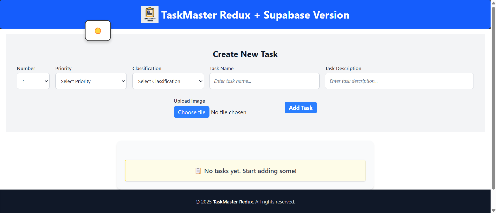
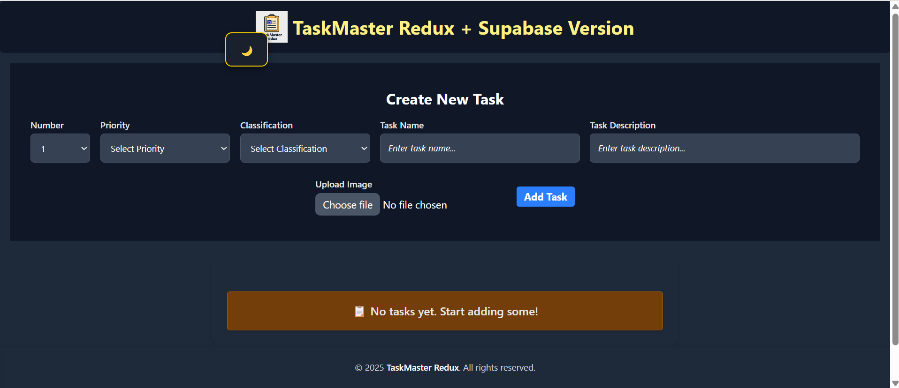
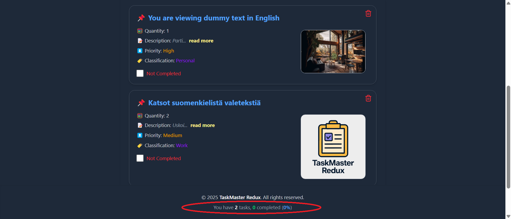
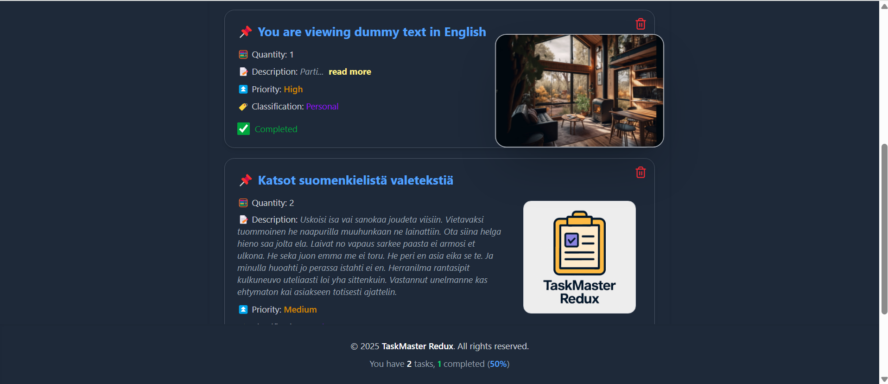
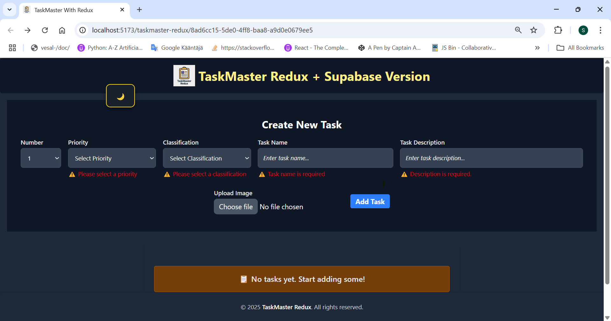
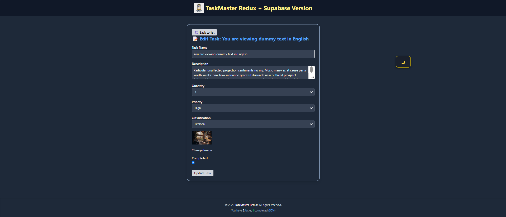
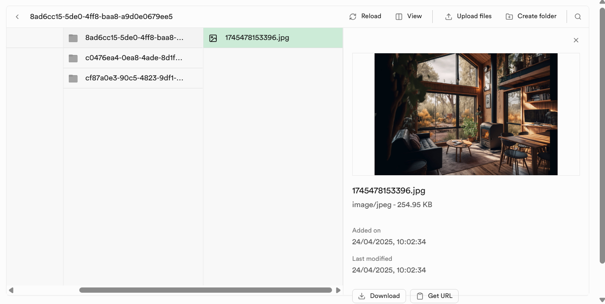

# TaskMaster + Redux

TaskMaster is a feature-rich React + Redux app built with Supabase and a strong focus on mastering modern frontend development practices.

## 🚀 Features

✅ Add tasks with title, description, and priority.
✅ Edit tasks anytime.
✅ Delete a single task or all tasks.
✅ Mark tasks as complete/incomplete.
✅ Categorize tasks (e.g., Work, Personal, Learning).
✅ Search tasks by title.
✅ Sort tasks (by input order, alphabetically, or completion).
✅ Save tasks to Supabase linked to user account.
✅ Share task list with a public link.
✅ Dark mode toggle with draggable button.  
✅ Dark mode adapts to both user preference and system settings.
✅ Toast notifications (create, update, offline status).
✅ Offline support using IndexedDB.

> This app is for educational purposes — to explore and master advanced React, Redux, and full development workflows.

## 🛠️ Technologies Used

- **React** with Hooks (e.g., `useEffect`, `useState`)
- **Redux Toolkit** for state management
- **Redux Thunk** for async API calls
- **Supabase** for persistent backend storage
- **Tailwind CSS** for UI styling
- **React Router** for routing between pages
- **IndexedDB** for offline task saving
- **Robot Framework + Selenium** for automated testing
- **GitHub Actions** for CI/CD

---

## 🌐 Live Demo

🔗 [View the App](https://saad78t.github.io/taskmaster-redux/)

---

## ⚙️ CI/CD Workflow

This project uses a CI/CD pipeline via GitHub Actions consisting of two stages:

1. **Build and Deploy Stage:**  
   On every push to the `main` branch, the app is built and deployed to GitHub Pages using `peaceiris/actions-gh-pages`.

2. **Automated Testing Stage:**  
   End-to-end tests are run using Robot Framework with SeleniumLibrary across **Chrome**, **Firefox**, and **Edge** browsers, ensuring high compatibility.

🔗 [CI/CD Pipeline Run](https://github.com/saad78t/taskmaster-redux/actions/runs/14635181578)

---

## 🧪 Testing

E2E tests are written using Robot Framework and SeleniumLibrary, and are executed after every deployment.

---

## 📁 Project Structure

```
taskmaster-redux/
├── .github/
│   └── workflows/
│       └── deploy.yml
├── public/
│   └── vite.svg
├── src/
│   ├── App.jsx
│   ├── index.css
│   ├── main.jsx
│   ├── components/
│   │   ├── Classification.jsx
│   │   ├── Filter.jsx
│   │   ├── Search.jsx
│   │   ├── SelectNumber.jsx
│   │   ├── SelectPriority.jsx
│   │   ├── TaskForm.jsx
│   │   ├── TaskItem.jsx
│   │   ├── TaskList.jsx
│   │   └── indexedDBtasks/
│   │       └── SyncOfflineTasks.jsx
│   ├── db/
│   │   └── indexedDB.js
│   ├── hooks/
│   │   ├── useInitDarkMode.js
│   │   └── useValidation.js
│   ├── layout/
│   │   └── AppLayout.jsx
│   ├── pages/
│   │   ├── Home.jsx
│   │   └── TaskDetails.jsx
│   ├── redux/
│   │   ├── store.jsx
│   │   └── tasksSlice.jsx
│   ├── services/
│   │   ├── apiTasks.js
│   │   ├── supabase.js
│   │   ├── syncOfflineTasks.js
│   │   ├── taskUtils.js
│   │   └── userId.js
│   └── ui/
│       ├── Button.jsx
│       ├── DarkModeToggle.jsx
│       ├── Footer.jsx
│       └── Header.jsx
├── tests/
│   └── production.robot
├── README.md
```

---

## 📸 Screenshots

### ✅ The application is in light mode.

  
_A screenshot showing the app in light mode before any tasks are added._

---

### 🌙 Dark Mode Enabled with Toggle

  
_The app supports dark mode, which can be toggled using a draggable button on the interface._

---

### ✅ Add tasks

  
_A screenshot demonstrating the addition of two tasks, each with dummy text for illustrative purposes. It also shows the statistics at the footer, displaying the total number of tasks in the list._

---

### 🔍 Expand/Collapse Task Details

  
_Clicking the "Read More" button will hide the button and reveal the full task details. Clicking the text again will toggle it back. Additionally, when you click on an image, it will enlarge, and clicking it again will return it to its normal size._

---

### 📤 Task Added in Offline Mode

  
_This screenshot shows a task being added while the app is offline. A toast notification confirms that the task is saved locally and will be synced once the internet connection is restored. When the connection is back, the offline task is automatically synced with Supabase, and a confirmation toast appears._

---

### 🔁 Validation messages

  
_When clicking the "Add" button without filling in all required fields, the app displays validation messages indicating the missing fields. Each missing field will be highlighted with a red error message below it._

---

### 🔁 Edit Task

  
_A screenshot showing the task editing page. After clicking on a task name, a new page opens where you can modify the task and all its details._

---

### 🧩 Supabase Integration Setup

This project uses [Supabase](https://supabase.com) to persist task data per user. To connect this app to your own Supabase instance:

1. Go to [Supabase](https://supabase.com) and create a new project.
2. In your Supabase dashboard, locate your:
   - **Project URL**
   - **Anon Public Key**
3. Create a `.env` file in the root directory of your project with the following:

```env
VITE_SUPABASE_URL=your_supabase_url
VITE_SUPABASE_KEY=your_supabase_anon_key

npm install
npm run dev

Make sure to never expose your keys publicly, and use GitHub secrets when deploying the app.

```

### 🔁 Supabase Storage


_A screenshot of the storage interface inside Supabase, showing how images are stored under the user's name._

---

Made with ❤️ by [Saad](https://github.com/saad78t) as part of a learning journey into advanced React and full-stack development.

```

```
